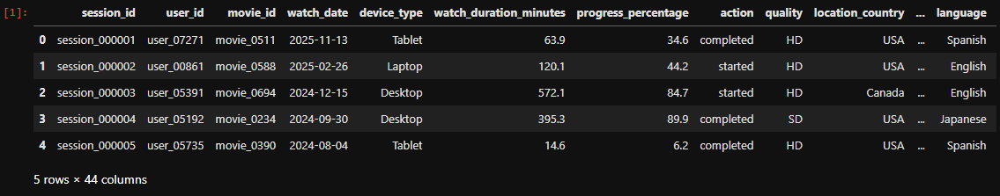
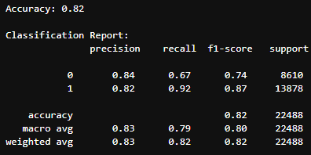
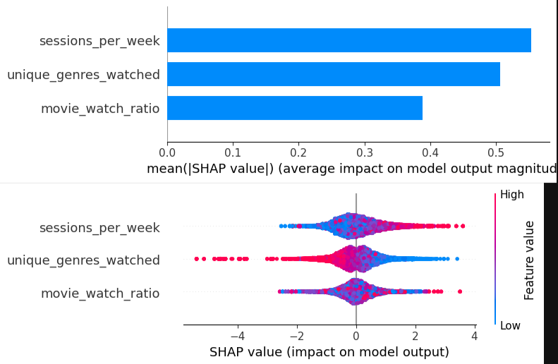
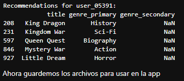
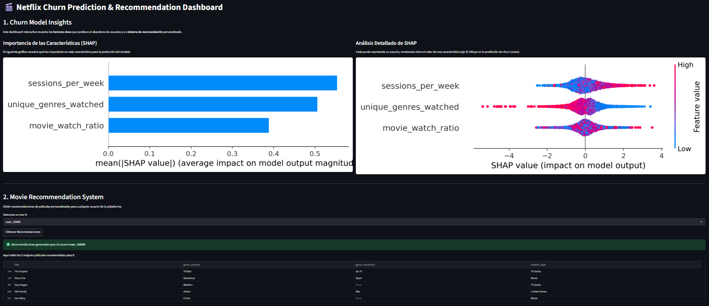

[Versión en Español](README.md)

# Netflix-style Churn Prediction & Recommendation System 🍿

This project presents a comprehensive data science process for a fictional streaming service, focusing on two fundamental business goals: predicting user churn and enhancing user engagement through a personalized movie recommendation system. It demonstrates the ability to manage the entire data science lifecycle, from data cleaning and feature engineering to model implementation and explainability.   

## Data Source 💾

The project uses a synthetic dataset obtained publicly from Kaggle. The data is divided into several CSV files, which can be downloaded and viewed here:

> https://www.kaggle.com/datasets/sayeeduddin/netflix-2025user-behavior-dataset-210k-records?resource=download

## Technologies Used 🐍
This project was developed using a solid set of Python libraries and tools to cover the entire script lifecycle.  

-   Pandas y NumPy: For data cleaning, manipulation, and feature engineering.  
-   Scikit-learn: For data splitting, model evaluation, and the implementation of the KNN-based recommendation system.  
-   XGBoost: A high-performance gradient boosting library used to build the churn prediction model.  
-   SHAP (SHapley Additive exPlanations): A powerful library for explaining machine learning model outputs, fundamental for communicating business insights.  
-   Matplotlib y Seaborn: For data visualization, including statistical charts and SHAP results.  
-   Streamlit: For creating and deploying the interactive web dashboard, which presents the project's results in a user-friendly format.  
-   Joblib: To efficiently save and load trained machine learning models, which speeds up the application.

## Installation Considerations ⚙️

To set up and run this project, it's recommended to use a conda environment. These libraries will help you create the necessary environment:  

bash
    ```
    pip install pandas numpy scikit-learn XGBoost seaborn matplotlib SHAP Streamlit Joblib
    ```  
    
Data Setup: Ensure that the data files from the Kaggle dataset are located in the working directory within the project's structure.  
Run the Script: Simply run the main script to ensure functionality from scratch, or deploy Streamlit assuming you have the files attached in the repository to work with the base version.  

## Usage Example 📎

The solution pipeline is a multi-phase process created with Python (tested in a Jupyter Notebook) and implemented with Streamlit.  

Data Engineering & Feature Creation:  
-   Data Consolidation: The three CSV files were merged into a single, unified DataFrame.    
-   Churn Definition: Churn was defined as a period of inactivity of 30, 60, or 90 days.    
-  Engagement Metrics: To quantify user engagement, including total_watch_duration, sessions_per_week, and unique_genres_watched.    



Churn Prediction Model:  
-   Model Selection: An XGBoost classifier was chosen for its high performance and ability to handle structured data.  
-   Model Performance: The model achieved an accuracy of 0.82 and a high recall of 0.92 (can be further verified with more procedures).    



Model Explainability with SHAP:  
-   Key Insight: SHAP (SHapley Additive exPlanations) was used, where the analysis revealed that sessions_per_week and unique_genres_watched were the two most important factors for predicting customer churn.    



Movie Recommendation System:  
-   Methodology: A collaborative filtering approach was implemented using K-Nearest Neighbors (KNN).     
-   User-Item Matrix: User engagement was quantified using a progress percentage metric, which was used to build a sparse user-item matrix for the KNN model.    
-   Result: The system successfully recommends movies to users based on the viewing habits of similar users, providing a more personalized experience.    



Dashboard Deployment:  
-   The entire project is implemented as an interactive web application using Streamlit.  




## Contributions 🖨️

If you're interested in contributing to this project or using it independently, consider:
-   Forking the repository.
-   Creating a new branch (git checkout -b feature/your-feature).
-   Making your changes and committing them (git commit -am 'Add new feature').
-   Pushing your changes to the branch (git push origin feature/your-feature).
-   Opening a 'Pull Request'.

## License 📜

This project is under the MIT License. Refer to the LICENSE file (if applicable) for more details.
